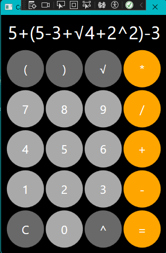
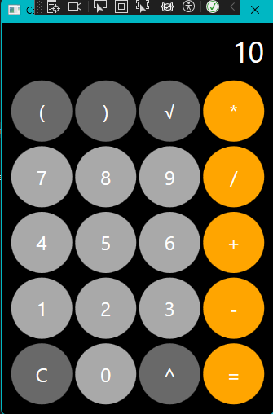

# PAC5_Calculadora

Una calculadora bàsica creada amb Visual Studio mitjançant C# inspirada en la clàssica de Apple en dispositius Iphone.
Software Opensurce sense cap mena de llicència.
## Índex 📑
1. [Requisits del Sistema](#requisits-del-sistema)
2. [Funcionalitats Principals](#funcionalitats-principals)
3. [Guia d'Instal·lació](#guia-dinstal·lació)
4. [Guia d'Ús](#guia-dús)
5. [Exemples d'Ús i Captures de Pantalla](#exemples-dús-i-captures-de-pantalla)
6. [Conclusions](#conclusions)

## Requisits del Sistema 🖥️ 
- **Sistema Operatiu:** Windows (compatible amb altres sistemes amb .NET Core).
- **Programari:** Visual Studio 2022, .NET Framework (o .NET Core, si és el cas).
- **Espai en disc:** 2MB

## Funcionalitats Principals ⚙️ 
- **Operacions bàsiques:** Suma, resta, multiplicació, divisió.
- **Interfície d'usuari:** Disseny amb botons per a les operacions i números.
- **Validacions:** Evita la divisió per zero i altres errors comuns.
- **Resultats immediats:** Els resultats es mostren en temps real a la pantalla.

## Guia d'Instal·lació 🛠️ 
Passos per instal·lar i executar l'aplicació:
1. **Descarregar el projecte:** Descarregar el repositori desde l'arxiu .GIT.
2. **Obrir amb Visual Studio:** Obrir el projecte en Visual Studio o algun IDE compatible.
4. **Compilar la Solució:** Compilar la solució i executar el projecte.

## Guia d'Ús 🚀 
Instruccions per fer servir la calculadora:
2. **Realitzar operacions:** Premer els botons dels numeros i els operadors per a realitzar la operació.
3. **Veure resultats:** Prémer el botó "=" per a poder obtenir-ne el resultat.
4. **Netejar:** Prémer el botó de "C" per borrar la operació actual i començar-ne una de nova.

## Exemples d'Ús i Captures de pantalla📸 

### Exemple:

- **Captures de pantalla:**
  
  
  

## Conclusions 📝 
- **Què he après?** He après la importància de l'ús de algoritmes com el de Shunting Yard per a poder fer que questions extremadaments simples per a nosaltres es puguin traduir a una màquina. També he millorat les meves habilitats per a la programació de interfícies i m'ha ajudat a entendre la importància de noves eines com les IA per a fer la feina bruta sota supervisió humana per a poder accelerar el treball de la mateixa manera que s'accelera al picar un paviment de formigó amb  amb un martell pneumàtic o una retro enlloc de fer servir un mai i una escarpa.
- **Problemes resolts:** Els principals problemes els he tingut per entendre bé el algoritme (ja que sorpenentment és el que més interesant he trobat de la pràctica) i en solucionar petits errors de codi en un codi que no estava fet des de 0 per mi per a poder fer-lo 100% funcional.
- **Millores futures:** Afegir més operacions, números decimals ( ja que estàn implementats però odiaba la idea de que la calculadora no fós simètrica ), un disseny propi més original e innovador, etc...
